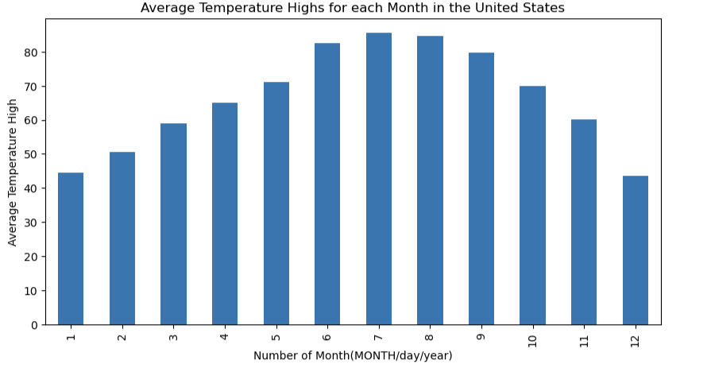
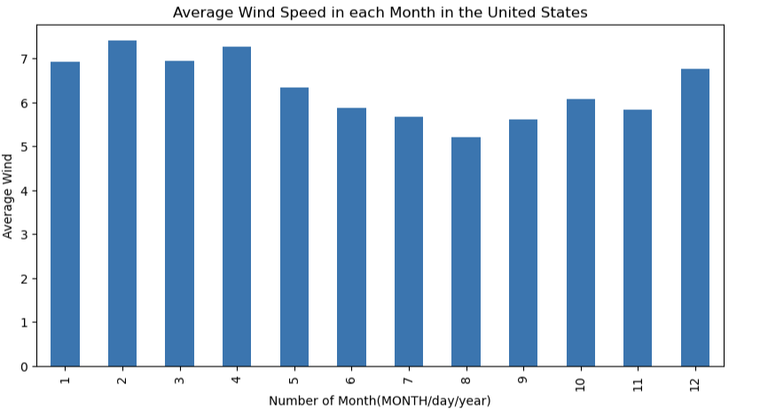
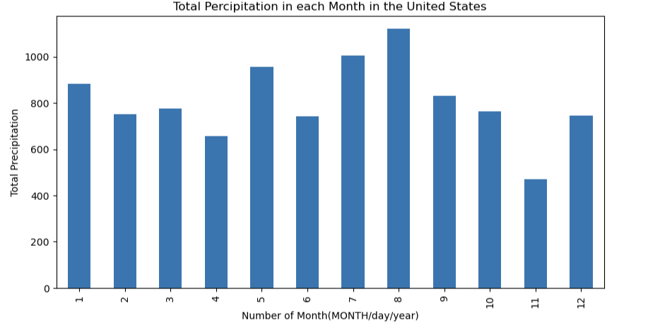

# CS-130 Project Article

## Introduction

This analysis examines how key weather variables such as precipitation temperature and wind speed change throughout the year in the United States of America. By organizing the data by month we can identify clear seasonal patterns and compare how different weather conditions fluctuate over time. The visualizations help reveal relationships between the seasons and overall climate behavior. Together they provide a clearer understanding of how weather varies in a structured and predictable way across the year. 

The data that is being analyzed is weather data that was reported over the span of 2016 and 2017. Despite the short scope of the data there are clear fluctuations that indicate certain weather seasons and events. 

---

## Average Maximum Temperature Analysis 

The average of the temperature highs follow a predictable seasonal pattern, gradually increasing to a peak in the middle of the year before decreasing again. This reflects the natural progression from winter to summer and back to winter. 

---

---

In this bar graph we can see those seasonal fluctuations fairly clearly. What I found to be most interesting about this graph is that even though it is only based on 2 years of data it paints a perfect picture of how temperature fluctuates over the entire country. 

---

## Total Wind Speed Analysis

The total wind speed varies throughout the year, showing noticeable seasonal shifts in wind activity. Some months experience higher wind speeds, likely due to stronger weather systems and storm patterns, while other months remain relatively calm. 

---

---

I found with this chart there is a slight inverse realationship to the temperature chart. This is interesting because it definitley reveals how in colder seasons around the United States, wind speeds are higher and when the climate warms wind speed slows down. 

Another key part of the wind speed data analysis is its correlation to tornado season. The peak months of tornado season in the United States is very known to be around the months of April and June. As seen this chart we can see how April is almost the highest average wind speed month and it persists and then declinces through June which is when the peak season ends. Also the data that was used to create the results is based on 2 years of weather data, so some other years may show a more dramatic representation. 

--- 

## Total Precipitation Analysis

The total precipitation changes significantly across the months, showing clear wet and dry periods throughout the year. Certain months receive much higher rainfall, which may correspond to seasonal storms or wetter climate periods, while other months show much lower precipitation levels.

---

---

This data shows us how inconsistent precipitation data can be. One of the factors that can affect the results is how different regions see different amounts of precipitation. This makes analyzing this data a little more difficult than the other data. 

Even though there is not much correlation to seasons in the data there is still evidence of certain weather seasons depicted in the chart. The first that I noticed is peak rain season, which is July and August. I relate this directly to our country's hurricane season. In those months tropical stroms drop the most amount of rain which is visualized in the data. The season that is fairly clear to me is spring. May is the runner up on highest total rainfall in the country, which makes sense because of how that is when the peak of spring hits almost nationwide.

--- 

## Conclusion

Overall, this analysis shows that weather patterns in the United States follow clear seasonal trends even within a limited two year dataset. Temperature, wind speed, and precipitation all fluctuate throughout the year in ways that align with expected seasonal changes. While some variables such as precipitation show more irregularity, others like temperature display very consistent patterns. Together, these results highlight how strongly time of year influences weather conditions and help reinforce the predictable nature of seasonal climate behavior.